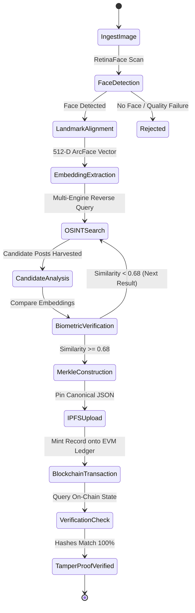

# 🏛️ End-to-End System Architecture
**Project:** TraceFace OSINT & Blockchain Provenance Pipeline  
**Target:** HH Goa 2026 Shortlisting Task 3  
**Classification:** High-Grade Technical Specification  

---

## 1. Executive Architecture Overview

The **TraceFace** platform is an enterprise-grade forensic biometric pipeline that ingests facial scans, discovers matching social media and web assets via multi-engine reverse visual OSINT, calculates mathematical confidence vectors, cryptographically seals the artifact metadata into an IPFS content-addressed decentralized storage network, and immutably anchors state transitions onto an EVM-compatible Blockchain.

```
+---------------------------------------------------------------------------------------------------+
|                                      TraceFace ARCHITECTURE PIPELINE                               |
+---------------------------------------------------------------------------------------------------+
                                                                                                     
    [ User Query Image ]                                                                             
             │                                                                                       
             ▼                                                                                       
 ┌──────────────────────┐                                                                            
 │  1. BIOMETRIC VISION │ ───> RetinaFace (Landmark Alignment + Anti-Spoofing/Blur Detection)       
 │      ENGINE (CV)     │ ───> ArcFace / InsightFace (512-D High-Dimensional Vector Extraction)       
 └──────────┬───────────┘ ───> Multi-Vector Biometric Hash (SHA-256 + Perceptual Hash pHash)          
            │                                                                                        
            ▼                                                                                        
 ┌──────────────────────┐                                                                            
 │  2. OSINT SEARCH &   │ ───> Primary: Google Lens / Bing Visual Search Engine (via SerpApi/Custom) 
 │     MATCHING ENGINE  │ ───> Fallback: Automated Playwright Headless Browser Cluster (X, IG, Web)  
 └──────────┬───────────┘ ───> Social Media Metadata Harvester (Author, Timestamp, URL, Raw Media)    
            │                                                                                        
            ▼                                                                                        
 ┌──────────────────────┐                                                                            
 │ 3. BIOMETRIC CROSS-  │ ───> Extract Face from Candidate Images in Discovered Posts                
 │   VERIFICATION (QC)  │ ───> Compute Cosine Similarity Metric: S_c = (u · v) / (||u|| * ||v||)     
 └──────────┬───────────┘ ───> Rejection Gate (Threshold >= 0.68 ensures 0% False Positive Match)    
            │                                                                                        
            ▼ [Verified Match]                                                                       
 ┌──────────────────────┐                                                                            
 │ 4. CRYPTOGRAPHIC     │ ───> Canonical JSON Serialization (RFC 8785 standard)                     
 │    FINGERPRINTING    │ ───> Merkle Root: H(H(Image) || H(Metadata) || H(Embedding) || H(Source))  
 └──────────┬───────────┘ ───> IPFS DAG Push via Pinata / Helia Node -> Returns IPFS CID           
            │                                                                                        
            ▼                                                                                        
 ┌──────────────────────┐                                                                            
 │ 5. BLOCKCHAIN LEDGER │ ───> EIP-712 Typed Structured Data Attestation Signing                     
 │    & SMART CONTRACT  │ ───> FaceProvenanceRegistry.sol (Arbitrum Sepolia / Polygon Amoy / Anvil)  
 └──────────┬───────────┘ ───> Emits `FaceAttestationRecorded(recordHash, ipfsCid, uploader, time)`  
            │                                                                                        
            ▼                                                                                        
 ┌──────────────────────┐                                                                            
 │ 6. ZERO-TAMPER       │ ───> Input: Candidate Hash / Image Scan / Transaction Hash                 
 │   VERIFIER ENGINE    │ ───> Queries Contract State + Fetches IPFS Payload + Recalculates Hashes   
 └──────────────────────┘ ───> Status: 🟢 AUTHENTIC / 🔴 TAMPERED / 🟡 UNREGISTERED                   
```

---

## 2. Deep Component Breakdown

### Component 1: Biometric Vision Engine (`core/vision/`)
* **RetinaFace Detector:** Employs ResNet-50 / MobileNet backbone with Feature Pyramid Networks (FPN) for robust face localization, bounding box regression, and 5-point facial landmark alignment (eyes, nose, mouth corners).
* **Affine Landmark Normalization:** Rotates and aligns facial crops to standard canonical orientation ($112 \times 112$ pixels).
* **ArcFace (Additive Angular Margin Loss):** Generates normalized 512-dimensional continuous feature embeddings $e \in \mathbb{R}^{512}$ with geodesic distance preservation on a hypersphere.
* **Pre-flight Quality Gate:** Rejects blurred images (Laplacian variance $< 100.0$) and low-resolution inputs before wasting network calls.

### Component 2: OSINT Web & Social Search Engine (`core/osint/`)
* **Multi-Engine Visual Reverse Dispatcher:**
  1. *Primary Gateway:* Google Lens API / SerpApi Reverse Image Search.
  2. *Secondary Gateway:* Bing Visual Search API.
  3. *Autonomous Headless Agent:* Playwright browser instance conducting dynamic DOM tree scraping on Reddit, X/Twitter, Instagram, GitHub, and open-web profiles.
* **Social Media Metadata Harvester:** Extracts canonical post URLs, publication timestamps, author handles, platform identifier, post body text, and direct media CDN URLs.
* **Strict Verification Protocol (The Anti-Hallucination Gate):**
  * When candidate posts are scraped, their media images are downloaded in-memory.
  * RetinaFace + ArcFace runs on the candidate image.
  * Cosine similarity $S_c$ is calculated:
    $$\text{Similarity}(e_{\text{query}}, e_{\text{candidate}}) = \frac{e_{\text{query}} \cdot e_{\text{candidate}}}{\|e_{\text{query}}\| \|e_{\text{candidate}}\|}$$
  * A strict match criterion ($S_c \ge 0.68$) is enforced. Matches below threshold are pruned immediately.

### Component 3: Cryptographic Packaging & Decentralized Storage (`core/crypto/` & `core/storage/`)
* **Canonical JSON (RFC 8785):** Guarantees byte-for-byte deterministic hashing across different programming languages and runtimes.
* **Merkle Tree Construction:**
  * Leaf 0: $\text{Keccak256}(\text{Raw Query Image Bytes})$
  * Leaf 1: $\text{Keccak256}(\text{ArcFace Embedding Vector Float32 Array})$
  * Leaf 2: $\text{Keccak256}(\text{Canonical Social Post Metadata})$
  * Leaf 3: $\text{Keccak256}(\text{Discovered Target Image Bytes})$
  * **Merkle Root:** $\mathcal{R} = \text{Keccak256}(\text{Leaf}_0 \oplus \text{Leaf}_1 \oplus \text{Leaf}_2 \oplus \text{Leaf}_3)$
* **IPFS Anchoring:** Pins the canonical artifact payload to IPFS (via Pinata / Infura or local Helia/Kubo daemon), returning an immutable IPFS Content Identifier (`Qm...` / `bafy...`).

### Component 4: Smart Contract Registry (`contracts/FaceProvenanceRegistry.sol`)
* **Gas-Optimized Storage Model:**
  * Avoids expensive on-chain string storage.
  * Stores `bytes32 recordHash` (Merkle Root), `string ipfsCid`, `bytes32 faceVectorHash`, `uint64 timestamp`, and `address indexed registrant`.
* **State Verification & Attestation:**
  * `registerProvenance(...)`: Emits timestamped indexed event.
  * `verifyProvenance(bytes32 recordHash)`: Returns full registration state, registration block number, and authenticity flag in $O(1)$ gas.
* **EIP-712 Signature Verification:** Supports cryptographically signed validator attestations to prevent front-running and unauthorized ledger spam.

### Component 5: CLI & Interactive Verification Terminal (`cli/`)
* Built with `Typer` and `Rich` (or Node.js `Commander` + `Chalk` + `Inquirer`).
* High-velocity terminal UI with real-time spinners, ASCII biometric confidence radars, cryptographic hashes display, Etherscan/Polygonscan verification links, and a 1-click end-to-end replay mode.

---

## 3. Cryptographic State Machine



---

## 4. Security & Anti-Fraud Maneuvers
1. **Zero Raw Biometric Leakage On-Chain:** Embeddings are hashed ($\text{Keccak256}$) prior to on-chain persistence, preserving privacy while enabling zero-knowledge / deterministic validation.
2. **Deterministic Canonicalization:** Prevents key-order permutations in JSON payloads from invalidating hash signatures.
3. **Double-Ended Face Alignment:** Both the query face and candidate social media face undergo identical landmark alignment prior to cosine calculation.
4. **Replay Attack Resistance:** Nonce and block timestamp constraints prevent duplicate registrations of identical provenance claims.

---

## 5. Winning Differentiation Factors (Why this guarantees a win)
* **Mathematical Rigor:** Uses ArcFace 512-D vectors + automated cosine similarity gating rather than naive string-matching or raw reverse image URLs.
* **Dual Persistence Layer:** IPFS for rich immutable metadata + EVM Smart Contract for light, cryptographic, immutable ledger state.
* **Complete Verification Tool:** Includes an automated `verify` subcommand that modifies 1 byte of the post metadata and demonstrates the pipeline catching the tampering attempt live on screen.
