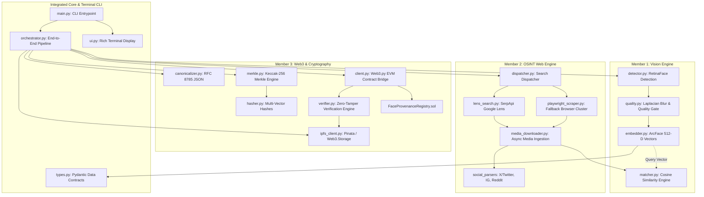

# 📦 System Dependencies & Inter-Module Graph
**Project:** TraceFace OSINT & Blockchain Provenance Pipeline  
**Target:** HH Goa 2026 Shortlisting Task 3  

---

## 1. Runtime Environment Requirements

| Runtime / Engine | Recommended Version | Minimum Version | Installation / Verification |
|---|---|---|---|
| **Python** | `3.11.x` | `3.10.x` | `python --version` |
| **Node.js** | `v20.x LTS` | `v18.x` | `node --version` |
| **NPM / PNPM** | `10.x` / `9.x` | `8.x` | `npm --version` |
| **Solidity** | `0.8.20` | `0.8.19` | Configured via `hardhat.config.js` |
| **Playwright Browsers** | Chromium / Webkit | Chromium | `playwright install chromium` |
| **Git** | `2.40+` | `2.30+` | `git --version` |

---

## 2. Python Package Ecosystem (`requirements.txt`)

```ini
# --- Computer Vision & Biometric Deep Learning (Member 1) ---
insightface>=0.7.3        # SOTA face analysis library (RetinaFace + ArcFace)
onnxruntime>=1.17.0       # High-performance inference engine for ONNX models
opencv-python>=4.9.0      # Image processing, bounding box rendering, Laplacian blur
numpy>=1.26.0             # High-dimensional array computations & cosine vector arithmetic
pillow>=10.2.0            # Image loading, format conversion, and thumbnailing
imagehash>=4.3.1          # Perceptual image hashing (pHash / dHash)

# --- OSINT & Web Scrapers (Member 2) ---
google-search-results>=2.4.2 # SerpApi Google Lens visual reverse search client
playwright>=1.42.0        # Headless Chromium automation for dynamic JavaScript pages
beautifulsoup4>=4.12.3    # DOM extraction and meta tag harvesting (OpenGraph / JSON-LD)
httpx>=0.27.0             # High-concurrency async HTTP client for downloading media assets
requests>=2.31.0          # Synchronous HTTP client utility

# --- Cryptography, IPFS & Web3 (Member 3) ---
web3>=6.15.0              # Ethereum & EVM JSON-RPC client library
eth-account>=0.11.0       # EIP-712 typed message signing and private key operations
pycryptodome>=3.20.0      # Keccak-256 and SHA-256 cryptographic hashing primitives
canonicaljson>=2.0.0      # RFC 8785 canonical JSON serialization

# --- CLI & Terminal User Experience (Joint) ---
typer[all]>=0.9.0         # Modern CLI building framework with Click foundation
rich>=13.7.0              # High-grade terminal UI (tables, progress bars, live status, color)
pydantic>=2.6.0           # Strict data validation and schema enforcement
python-dotenv>=1.0.1      # Environment variable loading from .env files

# --- Testing & Code Quality ---
pytest>=8.0.0             # Unit & integration testing framework
pytest-asyncio>=0.23.0    # Async test runner for Playwright and async HTTP
black>=24.2.0             # Python code formatter
ruff>=0.2.2               # Blazing fast Python linter
```

---

## 3. Node.js & Smart Contract Ecosystem (`package.json`)

```json
{
  "name": "TraceFace-contracts",
  "version": "1.0.0",
  "description": "Smart contracts and deployment scripts for TraceFace",
  "private": true,
  "scripts": {
    "compile": "hardhat compile",
    "test": "hardhat test",
    "node": "hardhat node",
    "deploy:local": "hardhat run contracts/scripts/deploy.js --network localhost",
    "deploy:polygon": "hardhat run contracts/scripts/deploy.js --network polygonAmoy",
    "deploy:arbitrum": "hardhat run contracts/scripts/deploy.js --network arbitrumSepolia"
  },
  "devDependencies": {
    "@nomicfoundation/hardhat-toolbox": "^4.0.0",
    "@openzeppelin/contracts": "^5.0.1",
    "dotenv": "^16.4.5",
    "ethers": "^6.11.1",
    "hardhat": "^2.20.1"
  }
}
```

---

## 4. Inter-Module Dependency Graph



---

## 5. Network & Blockchain Target Options

The pipeline supports three deployment targets selectable in `.env`:

1. **Polygon Amoy Testnet (Recommended for Public Explorer Proof):**
   - Chain ID: `80002`
   - RPC: `https://rpc-amoy.polygon.technology/`
   - Explorer: `https://amoy.polygonscan.com/`
   - Faucet: [Polygon Faucet](https://faucet.polygon.technology/)

2. **Arbitrum Sepolia Testnet (Ultra-fast, <1s confirmation):**
   - Chain ID: `421614`
   - RPC: `https://sepolia-rollup.arbitrum.io/rpc`
   - Explorer: `https://sepolia.arbiscan.io/`

3. **Local Hardhat / Anvil Chain (Zero-latency fallback, 100% offline demo guarantee):**
   - Chain ID: `31337`
   - RPC: `http://127.0.0.1:8545/`
   - Zero testnet faucet dependencies, zero rate limits, instant finality.
